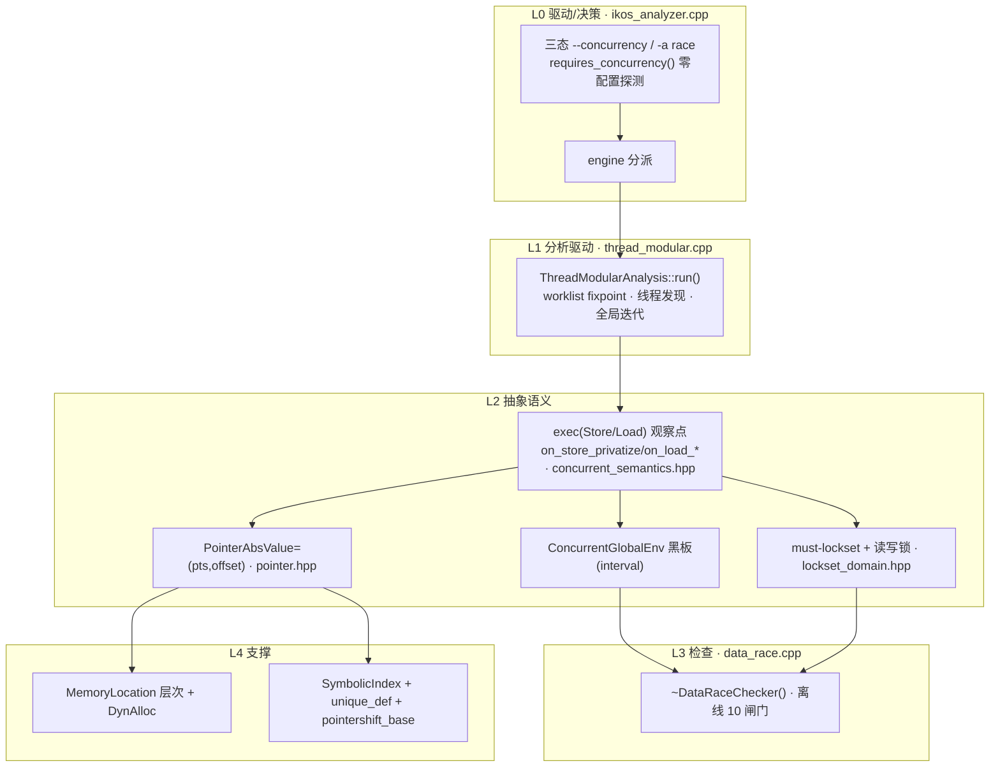
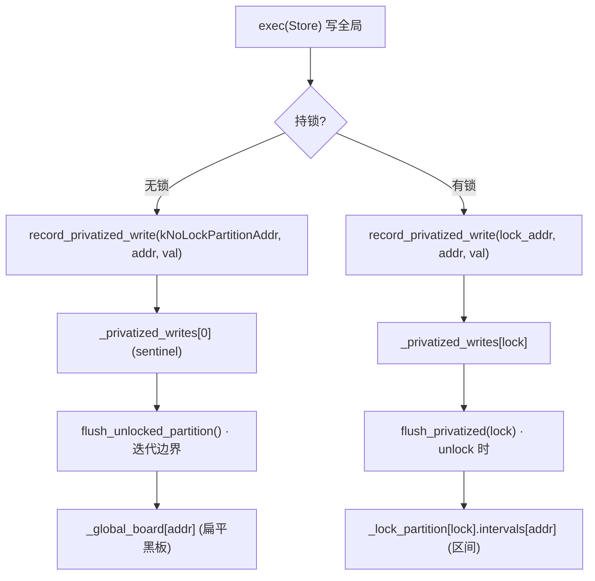
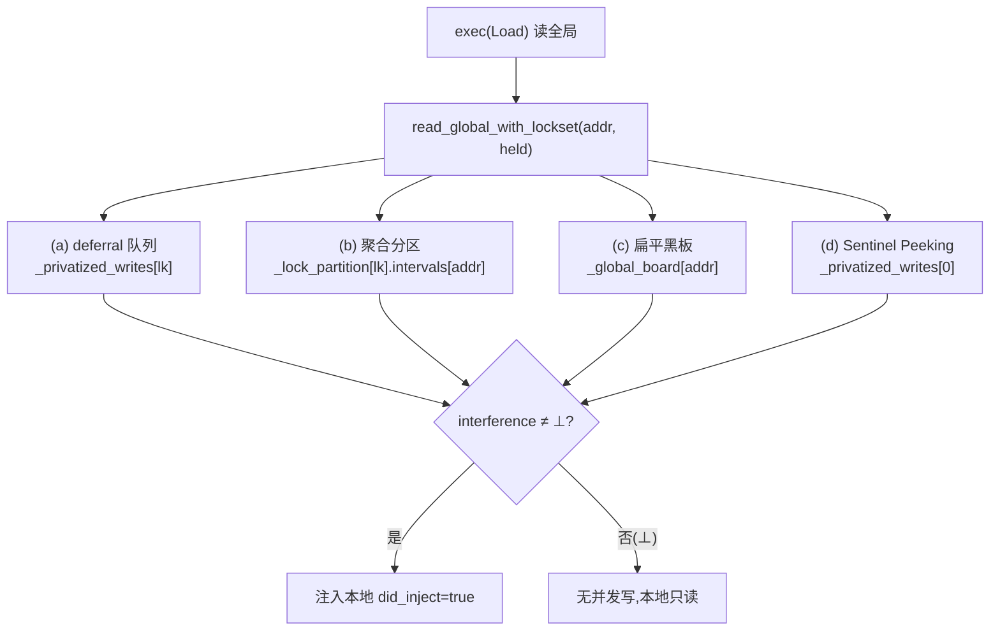
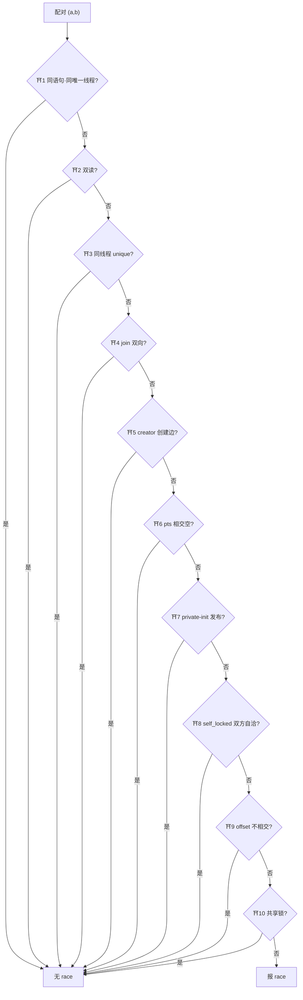
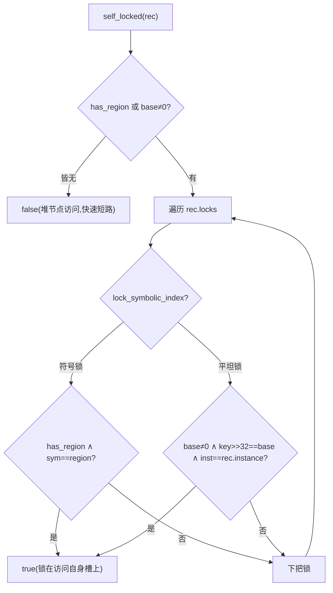
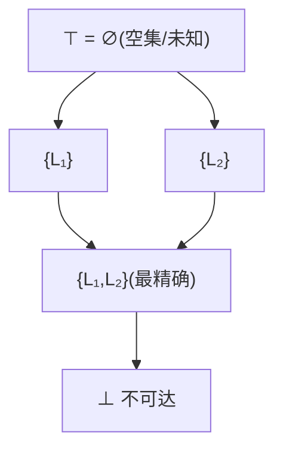
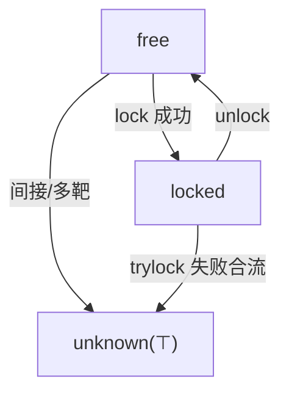
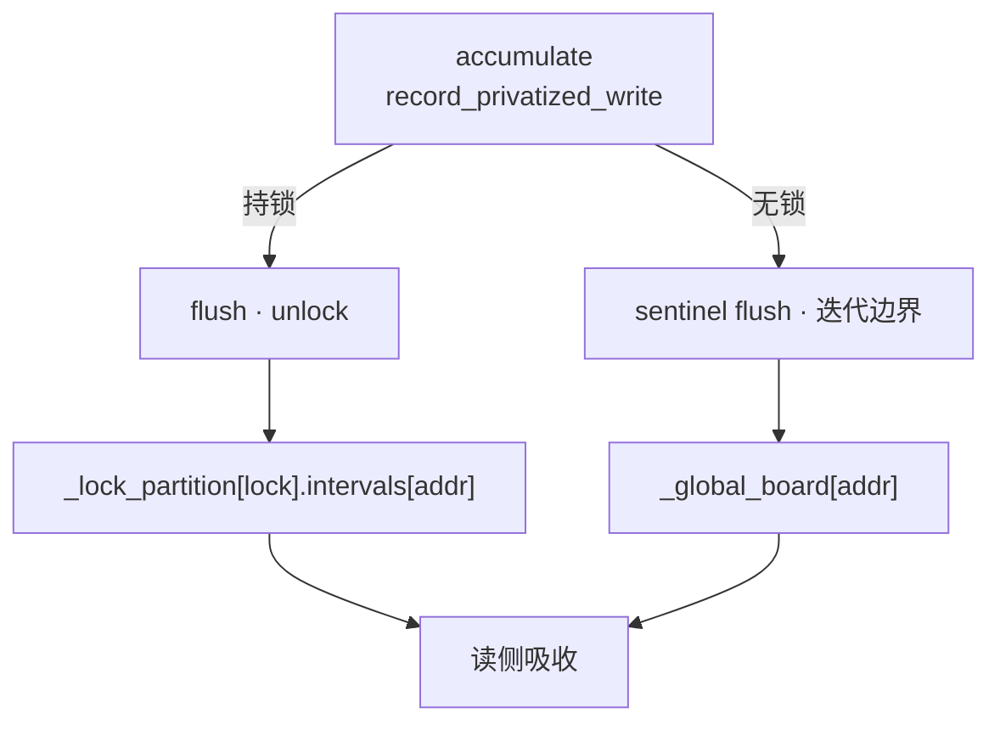
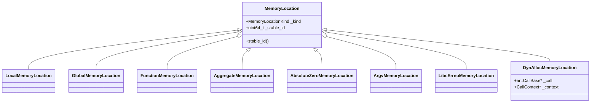

# IKOS 并发分析代码 架构文档

> 系统梳理 IKOS 静态分析器中 **并发数据竞争检测** 子系统的代码结构、运行原理与已知边界。
> 干扰模型为 **区间(interval) + Sentinel Peeking** 单后端。
> 面向两个目的:(1) 展示功能与原理;(2) 为后续优化 / 继续开发提供精确的**文件:行号**锚点与 **病理→优化种子**清单。

## 目录

1. [总体架构:五层分层](#1-总体架构五层分层)
2. [数据流:写路径与读路径](#2-数据流写路径与读路径)
3. [核心算法伪代码](#3-核心算法伪代码)
4. [判定流程:10 闸门](#4-判定流程10-闸门)
5. [理论格与状态机](#5-理论格与状态机)
6. [数据结构](#6-数据结构)
7. [病理与优化种子](#7-病理与优化种子)

---

## 1. 总体架构:五层分层

并发代码自上而下切为五层,层间只有向下的调用依赖。



**层锚点**:
- L0 engine 分派 → `ikos_analyzer.cpp:1317 / 1321`;零配置探测 → `:1279`
- L1 `run()` → `thread_modular.cpp:80`;全局迭代 → `:239`
- L2 `exec(Load)`/`exec(Store)` 守卫 → `numerical.hpp`（委托 `on_load_shared_uninit/on_load_pointer_restore/on_load_glob_flown/on_store_privatize` → `concurrent_semantics.hpp`）
- L3 `~DataRaceChecker` → `data_race.cpp:291`
- L4 `MemoryLocation` 层次 → `memory_location.hpp:80`;`SymbolicIndex` → `symbolic_index.hpp`

---

## 2. 数据流:写路径与读路径

干扰模型是**单向 interval 流**:写侧压入私有写队列 → flush 进分区/黑板;读侧按四级优先级吸收。**无 DBM/关系分支**。

### 写路径(Store → 黑板)



**锚点**:Strict Flush → `concurrent_semantics.hpp` 的 `on_store_privatize`;PBR → 同函数;`record_privatized_write`(二元 `{addr,val}`) → `concurrent_global_env.hpp:771`;`flush_privatized` → `:840`;`flush_unlocked_partition` → `:920`。

### 读路径(Load ← 黑板)



**锚点**:`read_global_with_lockset` → `concurrent_global_env.hpp:518`;(a) → `:550`;(b) → `:576`;(d) → `:607`;(c) → `:626`;注入点 → `concurrent_semantics.hpp` 的 `on_load_shared_uninit`/`on_load_pointer_restore`。

---

## 3. 核心算法伪代码

### 3.1 Thread-Modular worklist fixpoint

```text
run():                                        # thread_modular.cpp:80
  静态初始化全局变量                        # Phase 1
  运行全局构造函数                          # Phase 2
  worklist = [main] + 线程入口
  while true:                               # :239 全局迭代
    for func in worklist:
      分析 func(entry_inv)
    drain: flush_unlocked_partition()      # :318 迭代边界
    if not is_dirty(): break                # 收敛
    rebuild worklist(去重)
  运行 post-loop checks                     # Phase 4
```

### 3.2 写路径(PBR / Strict Flush)

```text
on_store_privatize(eng, ptr, val):           # concurrent_semantics.hpp
  for loc in points_to(ptr) where Global:
    val = RHS 的区间
    if 持锁:
      for lock in held_mutexes:
        record_privatized_write(lock, addr, val)   # PBR deferral
    else:
      record_privatized_write(kNoLockPartitionAddr, addr, val)  # Strict Flush
```

### 3.3 读路径(interference 注入)

```text
on_load_shared_uninit(eng, s, ptr, lhs):      # concurrent_semantics.hpp
  interference = read_global_with_lockset(addr, held)
  if interference != ⊥:
    did_inject = true
    吸收 interference 到本地 lhs
```

### 3.4 DataRaceChecker 十道闸门

```text
for pair (a, b), i < j:                      # data_race.cpp:415
  ⛩1 同语句且同唯一线程        → skip  # :424
  ⛩2 双读                      → skip  # :430
  ⛩3 HB 同线程且 unique        → skip  # :435
  ⛩4 HB join(双向)             → skip  # :440
  ⛩5 HB creator(创建边)        → skip  # :460
  ⛩6 pts 相交为空              → skip  # :482
  ⛩7 HB private-init 发布      → skip  # :507
  ⛩8 self_locked(a) ∧ self_locked(b) → skip  # :549
  ⛩9 offset 不相交(非 top)     → skip  # :562
  ⛩10 lockset 交集(互斥/读写锁) → skip  # :615
  # 十关全过 → 报 race
```

### 3.5 self_locked / region_collect

```text
self_locked(rec):                            # data_race.cpp:524
  if not rec.has_region and rec.base == 0: return false  # :532 快速短路
  for key in rec.locks:
    if lock_symbolic_index(key, base, sym):          # 符号锁
      if rec.has_region and sym == rec.region: return true   # :539
    else if rec.base != 0 and (key>>32) == rec.base
                and lock_instance(key) == rec.instance:
      return true                            # :542 平坦字段锁
  return false
```

```text
region_collect(v):                           # data_race.cpp:156
  def × PointerShift with global base → region 根(提取 {i})
  def × Load with global-rooted operand → 递归    # :230
  else → ambiguous = true                    # :233 堆字段/非全局 load
  def × Call / alloc / 不可追踪 leaf → ambiguous  # :258
  ⟹ has_region = (region_of 成功且无 ambiguous)  # :268
```

---

## 4. 判定流程:10 闸门



**⛩8 `self_locked` 子图**(7-FP 的汇流点):



> 关键:⛩8 是 7 个 FP 靶点无效化的地方——`region_collect` 对**堆节点 `->next` load 判 ambiguous**(data_race.cpp:233),导致 `has_region=false`,`self_locked` 的符号锁分支永不命中。直接对接 §7 的 Class A/B 病理。

---

## 5. 理论格与状态机

### 5.1 Must-Lockset 反向子集格



**铁律 `meet(⊤, x) = x`**:`meet = ∪`(union)、`join = ∩`,偏序 = "锁越多越精确越靠下"。
锚点:`lockset_domain.hpp:92 / 127-151 / 153-172`。

### 5.2 锁生命周期状态机



### 5.3 Privatized Write 生命周期(interval 单通道)



---

## 6. 数据结构

### 6.1 MemoryLocation 继承层次



> `DynAllocMemoryLocation` 只按 (call, context) 折叠——这是 Class A FP 的死因(见 §7)。

### 6.2 ConcurrentGlobalEnv 黑板结构

| 成员 | 用途 |
|---|---|
| `_global_board` | 扁平黑板(未锁干扰区间) |
| `_privatized_writes` | PBR deferral 队列 |
| `_lock_partition[].intervals` | 持锁分区(仅区间) |
| `_heap_pointer_board` | 堆字段指针传播 |
| `_lock_symbolic_index` / `_lock_instance` | 符号锁 / 字段锁 side table |
| `_discovered_thread_functions` / `_spawn_args` | 线程发现 / pthread_create arg 绑定 |
| `_site_ids` / `_func_instances` / `_site_func` | 线程**实例**注册表(create 点→site id、函数名→site id 集、site id→函数) |
| `_join_summary` | 每函数「退出时 MUST-join 摘要」(传递 join HB) |
| `_glob_flown_vars` | FS+FI 全局流标记 |
| `_escaped_locs` | 逃逸 |
| `_pending_cond_locks` | 条件锁 |
| `_is_dirty` / `_global_iteration` | 收敛标志 / 迭代计数 |

**AccessRecord 关键字段**:`stmt / call_context / kind / pts / locks / read_locks / offset / base / instance / has_region / region / thread_id / is_unique_thread / joined_threads(**site id 集**) / spawned_threads(函数名集) / private_init / promote_locks`(data_race.hpp:69-126)。

---

## 7. 病理与优化种子

| 病理 | 死因根 | 探针铁证 | 优化方向(种子) |
|---|---|---|---|
| Class A FP(11/13/17/19) | `get_dyn_alloc(call,ctx)` 折叠循环 malloc | dumprace 同一 `dyn_alloc:new:X:Y` | 调用点敏感 DynAlloc 键(方向已论证,未落地) |
| Class B FP(21/22/24) | 结构体字段 offset 变量偏移 widen 成 ⊤ | offset 探针 `a=T b=T` | 数据侧符号下标 / offset 收窄 |
| container_of offset 丢失 | `scalar_pointer_to_int` 只 forget 不回填 | def 链 `PS UN` offset=[0,0] | checker 层 container_of 语法回推 |

---

## 结语

本文档把并发分析代码的**结构**(§1)、**数据流**(§2)、**算法**(§3)、**判定流**(§4)、**格理论**(§5)、**数据结构**(§6)与**已知边界**(§7)串成一份可维护的架构地图。所有断言锚定到 `文件:行号`,后续优化与开发可直接从对应节点起步。图用 Mermaid,在 VSCode(markdown preview + Mermaid 插件)与 GitHub 上均可直接渲染。